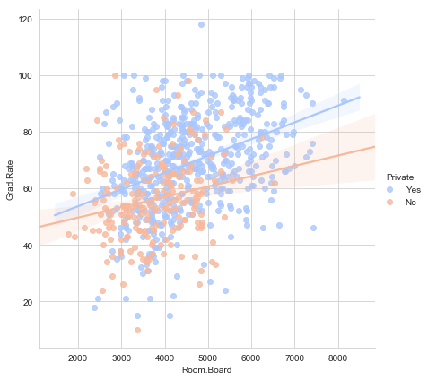
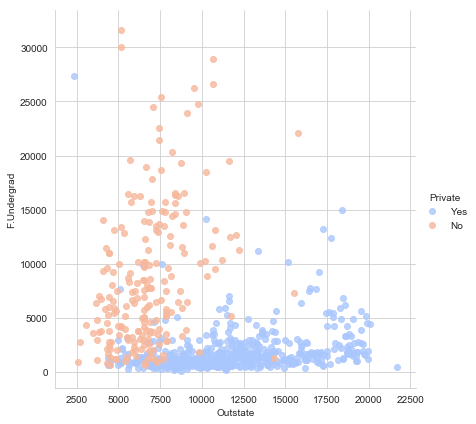
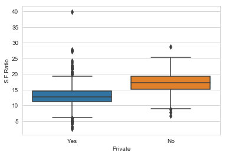
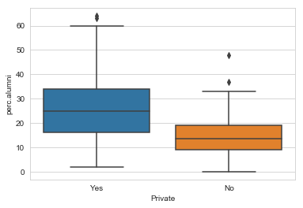
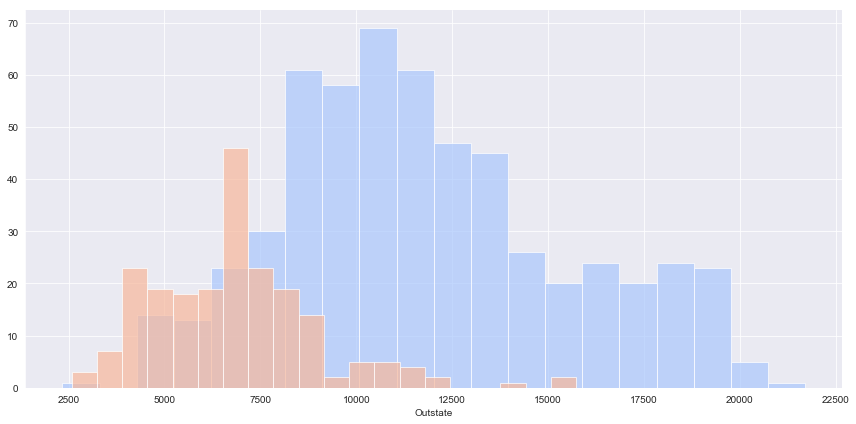
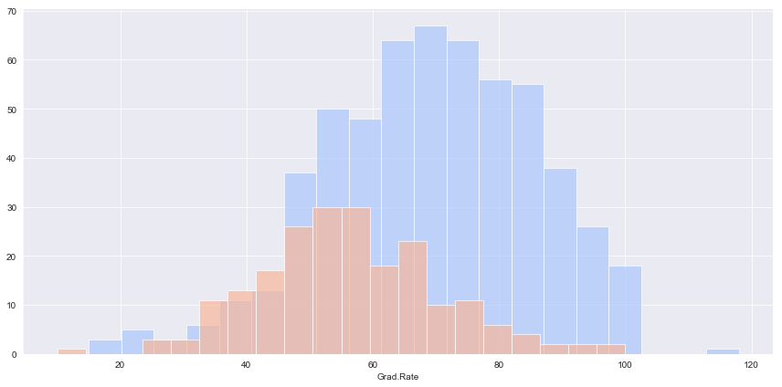
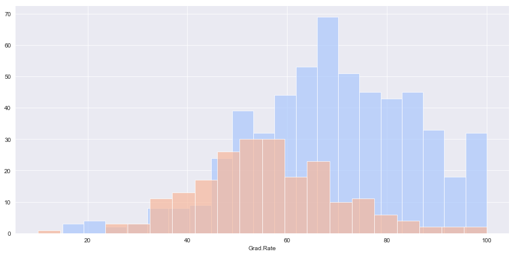

# K-Means-Clustering-for-Schools

Use K Means Clustering to cluster Universities into to two groups, Private and Public. We will use a data frame with 777 observations on the following 18 variables.


* Private A factor with levels No and Yes indicating private or public university
* Apps Number of applications received
* Accept Number of applications accepted
* Enroll Number of new students enrolled
* Top10perc Pct. new students from top 10% of H.S. class
* Top25perc Pct. new students from top 25% of H.S. class
* F.Undergrad Number of fulltime undergraduates
* P.Undergrad Number of parttime undergraduates
* Outstate Out-of-state tuition
* Room.Board Room and board costs
* Books Estimated book costs
* Personal Estimated personal spending
* PhD Pct. of faculty with Ph.D.’s
* Terminal Pct. of faculty with terminal degree
* S.F.Ratio Student/faculty ratio
* perc.alumni Pct. alumni who donate
* Expend Instructional expenditure per student
* Grad.Rate Graduation rate

### Import Libraries


```python
import pandas as pd
import numpy as np
import matplotlib.pyplot as plt
import seaborn as sns
%matplotlib inline
```

## Get the Data

** Read in the College_Data file using read_csv. Figure out how to set the first column as the index.**


```python
df = pd.read_csv('College_Data',index_col=0)
```

**Check the head of the data**


```python
df.head()
```


<div>
<style scoped>
    .dataframe tbody tr th:only-of-type {
        vertical-align: middle;
    }

    .dataframe tbody tr th {
        vertical-align: top;
    }

    .dataframe thead th {
        text-align: right;
    }
</style>
<table border="1" class="dataframe">
  <thead>
    <tr style="text-align: right;">
      <th></th>
      <th>Private</th>
      <th>Apps</th>
      <th>Accept</th>
      <th>Enroll</th>
      <th>Top10perc</th>
      <th>Top25perc</th>
      <th>F.Undergrad</th>
      <th>P.Undergrad</th>
      <th>Outstate</th>
      <th>Room.Board</th>
      <th>Books</th>
      <th>Personal</th>
      <th>PhD</th>
      <th>Terminal</th>
      <th>S.F.Ratio</th>
      <th>perc.alumni</th>
      <th>Expend</th>
      <th>Grad.Rate</th>
    </tr>
  </thead>
  <tbody>
    <tr>
      <th>Abilene Christian University</th>
      <td>Yes</td>
      <td>1660</td>
      <td>1232</td>
      <td>721</td>
      <td>23</td>
      <td>52</td>
      <td>2885</td>
      <td>537</td>
      <td>7440</td>
      <td>3300</td>
      <td>450</td>
      <td>2200</td>
      <td>70</td>
      <td>78</td>
      <td>18.1</td>
      <td>12</td>
      <td>7041</td>
      <td>60</td>
    </tr>
    <tr>
      <th>Adelphi University</th>
      <td>Yes</td>
      <td>2186</td>
      <td>1924</td>
      <td>512</td>
      <td>16</td>
      <td>29</td>
      <td>2683</td>
      <td>1227</td>
      <td>12280</td>
      <td>6450</td>
      <td>750</td>
      <td>1500</td>
      <td>29</td>
      <td>30</td>
      <td>12.2</td>
      <td>16</td>
      <td>10527</td>
      <td>56</td>
    </tr>
    <tr>
      <th>Adrian College</th>
      <td>Yes</td>
      <td>1428</td>
      <td>1097</td>
      <td>336</td>
      <td>22</td>
      <td>50</td>
      <td>1036</td>
      <td>99</td>
      <td>11250</td>
      <td>3750</td>
      <td>400</td>
      <td>1165</td>
      <td>53</td>
      <td>66</td>
      <td>12.9</td>
      <td>30</td>
      <td>8735</td>
      <td>54</td>
    </tr>
    <tr>
      <th>Agnes Scott College</th>
      <td>Yes</td>
      <td>417</td>
      <td>349</td>
      <td>137</td>
      <td>60</td>
      <td>89</td>
      <td>510</td>
      <td>63</td>
      <td>12960</td>
      <td>5450</td>
      <td>450</td>
      <td>875</td>
      <td>92</td>
      <td>97</td>
      <td>7.7</td>
      <td>37</td>
      <td>19016</td>
      <td>59</td>
    </tr>
    <tr>
      <th>Alaska Pacific University</th>
      <td>Yes</td>
      <td>193</td>
      <td>146</td>
      <td>55</td>
      <td>16</td>
      <td>44</td>
      <td>249</td>
      <td>869</td>
      <td>7560</td>
      <td>4120</td>
      <td>800</td>
      <td>1500</td>
      <td>76</td>
      <td>72</td>
      <td>11.9</td>
      <td>2</td>
      <td>10922</td>
      <td>15</td>
    </tr>
  </tbody>
</table>
</div>


** Check the info() and describe() methods on the data.**


```python
df.info()
```

    <class 'pandas.core.frame.DataFrame'>
    Index: 777 entries, Abilene Christian University to York College of Pennsylvania
    Data columns (total 18 columns):
    Private        777 non-null object
    Apps           777 non-null int64
    Accept         777 non-null int64
    Enroll         777 non-null int64
    Top10perc      777 non-null int64
    Top25perc      777 non-null int64
    F.Undergrad    777 non-null int64
    P.Undergrad    777 non-null int64
    Outstate       777 non-null int64
    Room.Board     777 non-null int64
    Books          777 non-null int64
    Personal       777 non-null int64
    PhD            777 non-null int64
    Terminal       777 non-null int64
    S.F.Ratio      777 non-null float64
    perc.alumni    777 non-null int64
    Expend         777 non-null int64
    Grad.Rate      777 non-null int64
    dtypes: float64(1), int64(16), object(1)
    memory usage: 115.3+ KB
    


```python
df.describe()
```


<div>
<style scoped>
    .dataframe tbody tr th:only-of-type {
        vertical-align: middle;
    }

    .dataframe tbody tr th {
        vertical-align: top;
    }

    .dataframe thead th {
        text-align: right;
    }
</style>
<table border="1" class="dataframe">
  <thead>
    <tr style="text-align: right;">
      <th></th>
      <th>Apps</th>
      <th>Accept</th>
      <th>Enroll</th>
      <th>Top10perc</th>
      <th>Top25perc</th>
      <th>F.Undergrad</th>
      <th>P.Undergrad</th>
      <th>Outstate</th>
      <th>Room.Board</th>
      <th>Books</th>
      <th>Personal</th>
      <th>PhD</th>
      <th>Terminal</th>
      <th>S.F.Ratio</th>
      <th>perc.alumni</th>
      <th>Expend</th>
      <th>Grad.Rate</th>
    </tr>
  </thead>
  <tbody>
    <tr>
      <th>count</th>
      <td>777.000000</td>
      <td>777.000000</td>
      <td>777.000000</td>
      <td>777.000000</td>
      <td>777.000000</td>
      <td>777.000000</td>
      <td>777.000000</td>
      <td>777.000000</td>
      <td>777.000000</td>
      <td>777.000000</td>
      <td>777.000000</td>
      <td>777.000000</td>
      <td>777.000000</td>
      <td>777.000000</td>
      <td>777.000000</td>
      <td>777.000000</td>
      <td>777.00000</td>
    </tr>
    <tr>
      <th>mean</th>
      <td>3001.638353</td>
      <td>2018.804376</td>
      <td>779.972973</td>
      <td>27.558559</td>
      <td>55.796654</td>
      <td>3699.907336</td>
      <td>855.298584</td>
      <td>10440.669241</td>
      <td>4357.526384</td>
      <td>549.380952</td>
      <td>1340.642214</td>
      <td>72.660232</td>
      <td>79.702703</td>
      <td>14.089704</td>
      <td>22.743887</td>
      <td>9660.171171</td>
      <td>65.46332</td>
    </tr>
    <tr>
      <th>std</th>
      <td>3870.201484</td>
      <td>2451.113971</td>
      <td>929.176190</td>
      <td>17.640364</td>
      <td>19.804778</td>
      <td>4850.420531</td>
      <td>1522.431887</td>
      <td>4023.016484</td>
      <td>1096.696416</td>
      <td>165.105360</td>
      <td>677.071454</td>
      <td>16.328155</td>
      <td>14.722359</td>
      <td>3.958349</td>
      <td>12.391801</td>
      <td>5221.768440</td>
      <td>17.17771</td>
    </tr>
    <tr>
      <th>min</th>
      <td>81.000000</td>
      <td>72.000000</td>
      <td>35.000000</td>
      <td>1.000000</td>
      <td>9.000000</td>
      <td>139.000000</td>
      <td>1.000000</td>
      <td>2340.000000</td>
      <td>1780.000000</td>
      <td>96.000000</td>
      <td>250.000000</td>
      <td>8.000000</td>
      <td>24.000000</td>
      <td>2.500000</td>
      <td>0.000000</td>
      <td>3186.000000</td>
      <td>10.00000</td>
    </tr>
    <tr>
      <th>25%</th>
      <td>776.000000</td>
      <td>604.000000</td>
      <td>242.000000</td>
      <td>15.000000</td>
      <td>41.000000</td>
      <td>992.000000</td>
      <td>95.000000</td>
      <td>7320.000000</td>
      <td>3597.000000</td>
      <td>470.000000</td>
      <td>850.000000</td>
      <td>62.000000</td>
      <td>71.000000</td>
      <td>11.500000</td>
      <td>13.000000</td>
      <td>6751.000000</td>
      <td>53.00000</td>
    </tr>
    <tr>
      <th>50%</th>
      <td>1558.000000</td>
      <td>1110.000000</td>
      <td>434.000000</td>
      <td>23.000000</td>
      <td>54.000000</td>
      <td>1707.000000</td>
      <td>353.000000</td>
      <td>9990.000000</td>
      <td>4200.000000</td>
      <td>500.000000</td>
      <td>1200.000000</td>
      <td>75.000000</td>
      <td>82.000000</td>
      <td>13.600000</td>
      <td>21.000000</td>
      <td>8377.000000</td>
      <td>65.00000</td>
    </tr>
    <tr>
      <th>75%</th>
      <td>3624.000000</td>
      <td>2424.000000</td>
      <td>902.000000</td>
      <td>35.000000</td>
      <td>69.000000</td>
      <td>4005.000000</td>
      <td>967.000000</td>
      <td>12925.000000</td>
      <td>5050.000000</td>
      <td>600.000000</td>
      <td>1700.000000</td>
      <td>85.000000</td>
      <td>92.000000</td>
      <td>16.500000</td>
      <td>31.000000</td>
      <td>10830.000000</td>
      <td>78.00000</td>
    </tr>
    <tr>
      <th>max</th>
      <td>48094.000000</td>
      <td>26330.000000</td>
      <td>6392.000000</td>
      <td>96.000000</td>
      <td>100.000000</td>
      <td>31643.000000</td>
      <td>21836.000000</td>
      <td>21700.000000</td>
      <td>8124.000000</td>
      <td>2340.000000</td>
      <td>6800.000000</td>
      <td>103.000000</td>
      <td>100.000000</td>
      <td>39.800000</td>
      <td>64.000000</td>
      <td>56233.000000</td>
      <td>118.00000</td>
    </tr>
  </tbody>
</table>
</div>


## Exploratory Analysis

** Create a scatterplot of Grad.Rate versus Room.Board (and their linear fit) where the points are colored by the Private column. **


```python
sns.set_style('whitegrid')
sns.lmplot('Room.Board','Grad.Rate',data=df, hue='Private',
           palette='coolwarm',size=6,aspect=1,fit_reg=True)
```

   
    


    <seaborn.axisgrid.FacetGrid at 0x2953f10e438>





**Create a scatterplot of F.Undergrad versus Outstate where the points are colored by the Private column.**

**The plot shows that these two feature dimensions separate out baed on the type of college**


```python
sns.set_style('whitegrid')
sns.lmplot('Outstate','F.Undergrad',data=df, hue='Private',
           palette='coolwarm',size=6,aspect=1,fit_reg=False)
```





** Create a boxplot of student-faculty ratio based on college type**


```python
sns.boxplot(x='Private',y='S.F.Ratio',data=df)
```


    <matplotlib.axes._subplots.AxesSubplot at 0x2953f4ecf28>





** Create a boxplot of percent of alumni who donate based on college type**


```python
sns.boxplot(x='Private',y='perc.alumni',data=df)
```


    <matplotlib.axes._subplots.AxesSubplot at 0x2953f569ac8>





** Create a stacked histogram showing Out of State Tuition based on the Private column.**


```python
sns.set_style('darkgrid')
g = sns.FacetGrid(df,hue="Private",palette='coolwarm',height=6,aspect=2)
g = g.map(plt.hist,'Outstate',bins=20,alpha=0.7)
```





**Create a similar histogram for the Grad.Rate column.**


```python
sns.set_style('darkgrid')
g = sns.FacetGrid(df,hue="Private",palette='coolwarm',height=6,aspect=2)
g = g.map(plt.hist,'Grad.Rate',bins=20,alpha=0.7)
```





**There seems to be a private school with a graduation rate of higher than 100%**


```python
df[df['Grad.Rate'] > 100]
```


<div>
<style scoped>
    .dataframe tbody tr th:only-of-type {
        vertical-align: middle;
    }

    .dataframe tbody tr th {
        vertical-align: top;
    }

    .dataframe thead th {
        text-align: right;
    }
</style>
<table border="1" class="dataframe">
  <thead>
    <tr style="text-align: right;">
      <th></th>
      <th>Private</th>
      <th>Apps</th>
      <th>Accept</th>
      <th>Enroll</th>
      <th>Top10perc</th>
      <th>Top25perc</th>
      <th>F.Undergrad</th>
      <th>P.Undergrad</th>
      <th>Outstate</th>
      <th>Room.Board</th>
      <th>Books</th>
      <th>Personal</th>
      <th>PhD</th>
      <th>Terminal</th>
      <th>S.F.Ratio</th>
      <th>perc.alumni</th>
      <th>Expend</th>
      <th>Grad.Rate</th>
    </tr>
  </thead>
  <tbody>
    <tr>
      <th>Cazenovia College</th>
      <td>Yes</td>
      <td>3847</td>
      <td>3433</td>
      <td>527</td>
      <td>9</td>
      <td>35</td>
      <td>1010</td>
      <td>12</td>
      <td>9384</td>
      <td>4840</td>
      <td>600</td>
      <td>500</td>
      <td>22</td>
      <td>47</td>
      <td>14.3</td>
      <td>20</td>
      <td>7697</td>
      <td>118</td>
    </tr>
  </tbody>
</table>
</div>


** Set that school's graduation rate to 100 so it makes sense. You may get a warning not an error) when doing this operation, so use dataframe operations or just re-do the histogram visualization to make sure it actually went through.**


```python
df['Grad.Rate']['Cazenovia College'] = 100
```


```python
df[df['Grad.Rate'] > 100]
```


<div>
<style scoped>
    .dataframe tbody tr th:only-of-type {
        vertical-align: middle;
    }

    .dataframe tbody tr th {
        vertical-align: top;
    }

    .dataframe thead th {
        text-align: right;
    }
</style>
<table border="1" class="dataframe">
  <thead>
    <tr style="text-align: right;">
      <th></th>
      <th>Private</th>
      <th>Apps</th>
      <th>Accept</th>
      <th>Enroll</th>
      <th>Top10perc</th>
      <th>Top25perc</th>
      <th>F.Undergrad</th>
      <th>P.Undergrad</th>
      <th>Outstate</th>
      <th>Room.Board</th>
      <th>Books</th>
      <th>Personal</th>
      <th>PhD</th>
      <th>Terminal</th>
      <th>S.F.Ratio</th>
      <th>perc.alumni</th>
      <th>Expend</th>
      <th>Grad.Rate</th>
    </tr>
  </thead>
  <tbody>
  </tbody>
</table>
</div>


```python
sns.set_style('darkgrid')
g = sns.FacetGrid(df,hue="Private",palette='coolwarm',height=6,aspect=2)
g = g.map(plt.hist,'Grad.Rate',bins=20,alpha=0.7)
```





## K Means Cluster Creation

** Import KMeans from SciKit Learn.**


```python
from sklearn.cluster import KMeans
```

** Create an instance of a K Means model with 2 clusters.**


```python
kmeans = KMeans(n_clusters=2,verbose=0,tol=1e-3,max_iter=300,n_init=20)
```

**Fit the model to all the data except for the Private label.**


```python
kmeans.fit(df.drop('Private',axis=1))
```


    KMeans(algorithm='auto', copy_x=True, init='k-means++', max_iter=300,
        n_clusters=2, n_init=20, n_jobs=None, precompute_distances='auto',
        random_state=None, tol=0.001, verbose=0)


** What are the cluster center vectors?**


```python
clus_cent=kmeans.cluster_centers_
clus_cent
```


    array([[1.81323468e+03, 1.28716592e+03, 4.91044843e+02, 2.53094170e+01,
            5.34708520e+01, 2.18854858e+03, 5.95458894e+02, 1.03957085e+04,
            4.31136472e+03, 5.41982063e+02, 1.28033632e+03, 7.04424514e+01,
            7.78251121e+01, 1.40997010e+01, 2.31748879e+01, 8.93204634e+03,
            6.50926756e+01],
           [1.03631389e+04, 6.55089815e+03, 2.56972222e+03, 4.14907407e+01,
            7.02037037e+01, 1.30619352e+04, 2.46486111e+03, 1.07191759e+04,
            4.64347222e+03, 5.95212963e+02, 1.71420370e+03, 8.63981481e+01,
            9.13333333e+01, 1.40277778e+01, 2.00740741e+01, 1.41705000e+04,
            6.75925926e+01]])


**Now compare these cluster centers (for all dimensions/features) to the known means of labeled data**


```python
df[df['Private']=='Yes'].describe() # Statistics for private colleges only
```


<div>
<style scoped>
    .dataframe tbody tr th:only-of-type {
        vertical-align: middle;
    }

    .dataframe tbody tr th {
        vertical-align: top;
    }

    .dataframe thead th {
        text-align: right;
    }
</style>
<table border="1" class="dataframe">
  <thead>
    <tr style="text-align: right;">
      <th></th>
      <th>Apps</th>
      <th>Accept</th>
      <th>Enroll</th>
      <th>Top10perc</th>
      <th>Top25perc</th>
      <th>F.Undergrad</th>
      <th>P.Undergrad</th>
      <th>Outstate</th>
      <th>Room.Board</th>
      <th>Books</th>
      <th>Personal</th>
      <th>PhD</th>
      <th>Terminal</th>
      <th>S.F.Ratio</th>
      <th>perc.alumni</th>
      <th>Expend</th>
      <th>Grad.Rate</th>
    </tr>
  </thead>
  <tbody>
    <tr>
      <th>count</th>
      <td>565.000000</td>
      <td>565.000000</td>
      <td>565.000000</td>
      <td>565.000000</td>
      <td>565.000000</td>
      <td>565.000000</td>
      <td>565.000000</td>
      <td>565.000000</td>
      <td>565.000000</td>
      <td>565.000000</td>
      <td>565.000000</td>
      <td>565.000000</td>
      <td>565.000000</td>
      <td>565.000000</td>
      <td>565.000000</td>
      <td>565.000000</td>
      <td>565.000000</td>
    </tr>
    <tr>
      <th>mean</th>
      <td>1977.929204</td>
      <td>1305.702655</td>
      <td>456.945133</td>
      <td>29.330973</td>
      <td>56.957522</td>
      <td>1872.168142</td>
      <td>433.966372</td>
      <td>11801.693805</td>
      <td>4586.143363</td>
      <td>547.506195</td>
      <td>1214.440708</td>
      <td>71.093805</td>
      <td>78.534513</td>
      <td>12.945487</td>
      <td>25.890265</td>
      <td>10486.353982</td>
      <td>68.966372</td>
    </tr>
    <tr>
      <th>std</th>
      <td>2443.341319</td>
      <td>1369.549478</td>
      <td>457.529136</td>
      <td>17.851391</td>
      <td>19.588360</td>
      <td>2110.661773</td>
      <td>722.370487</td>
      <td>3707.470822</td>
      <td>1089.697557</td>
      <td>174.932303</td>
      <td>632.879647</td>
      <td>17.350886</td>
      <td>15.450251</td>
      <td>3.518573</td>
      <td>12.400755</td>
      <td>5682.576587</td>
      <td>16.673032</td>
    </tr>
    <tr>
      <th>min</th>
      <td>81.000000</td>
      <td>72.000000</td>
      <td>35.000000</td>
      <td>1.000000</td>
      <td>9.000000</td>
      <td>139.000000</td>
      <td>1.000000</td>
      <td>2340.000000</td>
      <td>2370.000000</td>
      <td>250.000000</td>
      <td>250.000000</td>
      <td>8.000000</td>
      <td>24.000000</td>
      <td>2.500000</td>
      <td>2.000000</td>
      <td>3186.000000</td>
      <td>15.000000</td>
    </tr>
    <tr>
      <th>25%</th>
      <td>619.000000</td>
      <td>501.000000</td>
      <td>206.000000</td>
      <td>17.000000</td>
      <td>42.000000</td>
      <td>840.000000</td>
      <td>63.000000</td>
      <td>9100.000000</td>
      <td>3736.000000</td>
      <td>450.000000</td>
      <td>800.000000</td>
      <td>60.000000</td>
      <td>68.000000</td>
      <td>11.100000</td>
      <td>16.000000</td>
      <td>7477.000000</td>
      <td>58.000000</td>
    </tr>
    <tr>
      <th>50%</th>
      <td>1133.000000</td>
      <td>859.000000</td>
      <td>328.000000</td>
      <td>25.000000</td>
      <td>55.000000</td>
      <td>1274.000000</td>
      <td>207.000000</td>
      <td>11200.000000</td>
      <td>4400.000000</td>
      <td>500.000000</td>
      <td>1100.000000</td>
      <td>73.000000</td>
      <td>81.000000</td>
      <td>12.700000</td>
      <td>25.000000</td>
      <td>8954.000000</td>
      <td>69.000000</td>
    </tr>
    <tr>
      <th>75%</th>
      <td>2186.000000</td>
      <td>1580.000000</td>
      <td>520.000000</td>
      <td>36.000000</td>
      <td>70.000000</td>
      <td>2018.000000</td>
      <td>541.000000</td>
      <td>13970.000000</td>
      <td>5400.000000</td>
      <td>600.000000</td>
      <td>1500.000000</td>
      <td>85.000000</td>
      <td>92.000000</td>
      <td>14.500000</td>
      <td>34.000000</td>
      <td>11625.000000</td>
      <td>81.000000</td>
    </tr>
    <tr>
      <th>max</th>
      <td>20192.000000</td>
      <td>13007.000000</td>
      <td>4615.000000</td>
      <td>96.000000</td>
      <td>100.000000</td>
      <td>27378.000000</td>
      <td>10221.000000</td>
      <td>21700.000000</td>
      <td>8124.000000</td>
      <td>2340.000000</td>
      <td>6800.000000</td>
      <td>100.000000</td>
      <td>100.000000</td>
      <td>39.800000</td>
      <td>64.000000</td>
      <td>56233.000000</td>
      <td>100.000000</td>
    </tr>
  </tbody>
</table>
</div>


```python
df[df['Private']=='No'].describe() # Statistics for public colleges only
```


<div>
<style scoped>
    .dataframe tbody tr th:only-of-type {
        vertical-align: middle;
    }

    .dataframe tbody tr th {
        vertical-align: top;
    }

    .dataframe thead th {
        text-align: right;
    }
</style>
<table border="1" class="dataframe">
  <thead>
    <tr style="text-align: right;">
      <th></th>
      <th>Apps</th>
      <th>Accept</th>
      <th>Enroll</th>
      <th>Top10perc</th>
      <th>Top25perc</th>
      <th>F.Undergrad</th>
      <th>P.Undergrad</th>
      <th>Outstate</th>
      <th>Room.Board</th>
      <th>Books</th>
      <th>Personal</th>
      <th>PhD</th>
      <th>Terminal</th>
      <th>S.F.Ratio</th>
      <th>perc.alumni</th>
      <th>Expend</th>
      <th>Grad.Rate</th>
    </tr>
  </thead>
  <tbody>
    <tr>
      <th>count</th>
      <td>212.000000</td>
      <td>212.000000</td>
      <td>212.000000</td>
      <td>212.000000</td>
      <td>212.000000</td>
      <td>212.000000</td>
      <td>212.000000</td>
      <td>212.000000</td>
      <td>212.000000</td>
      <td>212.000000</td>
      <td>212.000000</td>
      <td>212.000000</td>
      <td>212.000000</td>
      <td>212.000000</td>
      <td>212.000000</td>
      <td>212.000000</td>
      <td>212.000000</td>
    </tr>
    <tr>
      <th>mean</th>
      <td>5729.919811</td>
      <td>3919.287736</td>
      <td>1640.872642</td>
      <td>22.834906</td>
      <td>52.702830</td>
      <td>8571.004717</td>
      <td>1978.188679</td>
      <td>6813.410377</td>
      <td>3748.240566</td>
      <td>554.377358</td>
      <td>1676.981132</td>
      <td>76.834906</td>
      <td>82.816038</td>
      <td>17.139151</td>
      <td>14.358491</td>
      <td>7458.316038</td>
      <td>56.042453</td>
    </tr>
    <tr>
      <th>std</th>
      <td>5370.675335</td>
      <td>3477.266276</td>
      <td>1261.592009</td>
      <td>16.180443</td>
      <td>20.091058</td>
      <td>6467.696087</td>
      <td>2321.034696</td>
      <td>2145.248389</td>
      <td>858.139928</td>
      <td>135.729935</td>
      <td>677.515680</td>
      <td>12.317525</td>
      <td>12.069669</td>
      <td>3.418049</td>
      <td>7.518935</td>
      <td>2695.541611</td>
      <td>14.583412</td>
    </tr>
    <tr>
      <th>min</th>
      <td>233.000000</td>
      <td>233.000000</td>
      <td>153.000000</td>
      <td>1.000000</td>
      <td>12.000000</td>
      <td>633.000000</td>
      <td>9.000000</td>
      <td>2580.000000</td>
      <td>1780.000000</td>
      <td>96.000000</td>
      <td>400.000000</td>
      <td>33.000000</td>
      <td>33.000000</td>
      <td>6.700000</td>
      <td>0.000000</td>
      <td>3605.000000</td>
      <td>10.000000</td>
    </tr>
    <tr>
      <th>25%</th>
      <td>2190.750000</td>
      <td>1563.250000</td>
      <td>701.750000</td>
      <td>12.000000</td>
      <td>37.000000</td>
      <td>3601.000000</td>
      <td>600.000000</td>
      <td>5366.000000</td>
      <td>3121.500000</td>
      <td>500.000000</td>
      <td>1200.000000</td>
      <td>71.000000</td>
      <td>76.000000</td>
      <td>15.100000</td>
      <td>9.000000</td>
      <td>5715.000000</td>
      <td>46.000000</td>
    </tr>
    <tr>
      <th>50%</th>
      <td>4307.000000</td>
      <td>2929.500000</td>
      <td>1337.500000</td>
      <td>19.000000</td>
      <td>51.000000</td>
      <td>6785.500000</td>
      <td>1375.000000</td>
      <td>6609.000000</td>
      <td>3708.000000</td>
      <td>550.000000</td>
      <td>1649.000000</td>
      <td>78.500000</td>
      <td>86.000000</td>
      <td>17.250000</td>
      <td>13.500000</td>
      <td>6716.500000</td>
      <td>55.000000</td>
    </tr>
    <tr>
      <th>75%</th>
      <td>7722.500000</td>
      <td>5264.000000</td>
      <td>2243.750000</td>
      <td>27.500000</td>
      <td>65.000000</td>
      <td>12507.000000</td>
      <td>2495.250000</td>
      <td>7844.000000</td>
      <td>4362.000000</td>
      <td>612.000000</td>
      <td>2051.250000</td>
      <td>86.000000</td>
      <td>92.000000</td>
      <td>19.325000</td>
      <td>19.000000</td>
      <td>8570.250000</td>
      <td>65.000000</td>
    </tr>
    <tr>
      <th>max</th>
      <td>48094.000000</td>
      <td>26330.000000</td>
      <td>6392.000000</td>
      <td>95.000000</td>
      <td>100.000000</td>
      <td>31643.000000</td>
      <td>21836.000000</td>
      <td>15732.000000</td>
      <td>6540.000000</td>
      <td>1125.000000</td>
      <td>4288.000000</td>
      <td>103.000000</td>
      <td>100.000000</td>
      <td>28.800000</td>
      <td>48.000000</td>
      <td>16527.000000</td>
      <td>100.000000</td>
    </tr>
  </tbody>
</table>
</div>


**Create a data frame with cluster centers and with column names borrowed from the original data frame**

**Is it clear from this data frame which label corresponds to private college (0 or 1)?**


```python
df_desc=pd.DataFrame(df.describe())
feat = list(df_desc.columns)
kmclus = pd.DataFrame(clus_cent,columns=feat)
kmclus
```


<div>
<style scoped>
    .dataframe tbody tr th:only-of-type {
        vertical-align: middle;
    }

    .dataframe tbody tr th {
        vertical-align: top;
    }

    .dataframe thead th {
        text-align: right;
    }
</style>
<table border="1" class="dataframe">
  <thead>
    <tr style="text-align: right;">
      <th></th>
      <th>Apps</th>
      <th>Accept</th>
      <th>Enroll</th>
      <th>Top10perc</th>
      <th>Top25perc</th>
      <th>F.Undergrad</th>
      <th>P.Undergrad</th>
      <th>Outstate</th>
      <th>Room.Board</th>
      <th>Books</th>
      <th>Personal</th>
      <th>PhD</th>
      <th>Terminal</th>
      <th>S.F.Ratio</th>
      <th>perc.alumni</th>
      <th>Expend</th>
      <th>Grad.Rate</th>
    </tr>
  </thead>
  <tbody>
    <tr>
      <th>0</th>
      <td>1813.234679</td>
      <td>1287.165919</td>
      <td>491.044843</td>
      <td>25.309417</td>
      <td>53.470852</td>
      <td>2188.548580</td>
      <td>595.458894</td>
      <td>10395.708520</td>
      <td>4311.364723</td>
      <td>541.982063</td>
      <td>1280.336323</td>
      <td>70.442451</td>
      <td>77.825112</td>
      <td>14.099701</td>
      <td>23.174888</td>
      <td>8932.046338</td>
      <td>65.092676</td>
    </tr>
    <tr>
      <th>1</th>
      <td>10363.138889</td>
      <td>6550.898148</td>
      <td>2569.722222</td>
      <td>41.490741</td>
      <td>70.203704</td>
      <td>13061.935185</td>
      <td>2464.861111</td>
      <td>10719.175926</td>
      <td>4643.472222</td>
      <td>595.212963</td>
      <td>1714.203704</td>
      <td>86.398148</td>
      <td>91.333333</td>
      <td>14.027778</td>
      <td>20.074074</td>
      <td>14170.500000</td>
      <td>67.592593</td>
    </tr>
  </tbody>
</table>
</div>


**What are the cluster labels?**


```python
kmeans.labels_
```


    array([0, 0, 0, 0, 0, 0, 0, 0, 0, 0, 0, 0, 0, 0, 0, 0, 0, 0, 0, 0, 1, 1,
           0, 1, 0, 0, 0, 1, 0, 0, 0, 0, 0, 0, 0, 0, 0, 0, 0, 1, 0, 0, 0, 0,
           0, 0, 0, 0, 0, 0, 0, 0, 0, 0, 0, 0, 0, 0, 0, 1, 0, 1, 0, 0, 0, 0,
           0, 0, 0, 1, 1, 0, 0, 0, 0, 0, 0, 0, 1, 1, 0, 0, 0, 0, 0, 0, 0, 1,
           0, 0, 0, 0, 0, 0, 0, 0, 0, 0, 0, 0, 0, 0, 0, 0, 0, 0, 0, 0, 0, 0,
           0, 0, 0, 0, 0, 0, 0, 0, 1, 0, 0, 0, 0, 0, 0, 0, 0, 0, 0, 0, 0, 0,
           0, 0, 0, 0, 0, 0, 0, 0, 0, 1, 0, 0, 1, 0, 0, 0, 0, 0, 0, 0, 0, 0,
           0, 0, 0, 0, 1, 0, 0, 0, 0, 0, 0, 0, 0, 0, 0, 0, 0, 0, 0, 0, 1, 0,
           1, 0, 0, 0, 0, 0, 0, 0, 0, 0, 0, 0, 0, 0, 0, 1, 0, 0, 0, 0, 0, 0,
           0, 0, 0, 0, 0, 1, 0, 0, 0, 0, 0, 0, 0, 0, 0, 0, 0, 0, 0, 0, 0, 1,
           0, 1, 1, 0, 0, 0, 0, 0, 0, 0, 0, 0, 0, 0, 0, 0, 0, 0, 0, 0, 0, 0,
           0, 0, 0, 0, 0, 0, 0, 0, 1, 0, 0, 0, 0, 0, 0, 1, 0, 0, 0, 0, 0, 0,
           0, 0, 0, 0, 0, 1, 0, 0, 0, 0, 1, 0, 0, 1, 0, 1, 0, 0, 0, 0, 1, 0,
           0, 0, 1, 0, 0, 0, 0, 0, 0, 0, 0, 0, 0, 0, 0, 0, 0, 0, 0, 0, 0, 0,
           0, 0, 0, 0, 0, 0, 0, 0, 0, 0, 0, 0, 0, 0, 0, 0, 1, 0, 0, 0, 0, 0,
           0, 0, 0, 0, 0, 0, 0, 0, 0, 0, 0, 0, 0, 0, 0, 0, 0, 0, 0, 0, 0, 0,
           0, 0, 1, 0, 0, 0, 0, 0, 0, 0, 0, 0, 0, 1, 1, 0, 0, 0, 0, 0, 0, 0,
           0, 0, 0, 0, 0, 0, 0, 0, 0, 0, 0, 0, 0, 0, 0, 0, 0, 0, 0, 0, 0, 0,
           0, 0, 0, 0, 0, 0, 0, 0, 0, 0, 0, 1, 0, 0, 0, 0, 1, 0, 0, 0, 0, 0,
           1, 1, 1, 0, 0, 0, 1, 0, 0, 0, 0, 0, 0, 0, 1, 0, 0, 0, 1, 0, 0, 0,
           0, 0, 0, 0, 0, 1, 0, 0, 0, 0, 0, 0, 0, 0, 0, 0, 0, 0, 0, 1, 0, 1,
           0, 0, 0, 0, 0, 0, 0, 0, 0, 0, 0, 0, 0, 0, 0, 0, 0, 0, 0, 0, 0, 1,
           0, 0, 0, 0, 0, 0, 0, 0, 0, 0, 0, 0, 0, 0, 0, 0, 0, 0, 0, 0, 0, 0,
           0, 0, 0, 0, 1, 0, 0, 0, 0, 0, 0, 0, 0, 0, 0, 0, 0, 0, 0, 0, 0, 0,
           0, 0, 0, 0, 0, 0, 0, 0, 1, 0, 0, 0, 0, 0, 0, 0, 0, 0, 0, 0, 0, 0,
           0, 0, 0, 0, 0, 0, 0, 0, 0, 0, 1, 1, 1, 1, 0, 0, 0, 0, 0, 0, 0, 0,
           0, 0, 0, 0, 1, 0, 0, 0, 0, 1, 0, 0, 0, 0, 0, 0, 0, 0, 0, 0, 0, 0,
           0, 0, 0, 1, 0, 0, 0, 0, 0, 0, 0, 1, 1, 1, 0, 1, 1, 1, 0, 0, 1, 0,
           0, 0, 0, 1, 1, 0, 1, 1, 1, 0, 1, 0, 1, 0, 0, 0, 0, 1, 1, 0, 1, 1,
           0, 0, 1, 0, 1, 0, 0, 0, 0, 1, 0, 1, 0, 1, 1, 0, 0, 0, 0, 1, 0, 0,
           1, 1, 1, 1, 1, 0, 0, 1, 0, 1, 0, 0, 0, 0, 0, 1, 1, 1, 0, 0, 0, 0,
           0, 1, 0, 1, 0, 0, 0, 0, 0, 1, 1, 1, 1, 0, 0, 0, 0, 0, 1, 1, 0, 0,
           0, 0, 0, 0, 1, 0, 1, 1, 0, 1, 0, 0, 0, 0, 0, 0, 1, 0, 0, 0, 0, 0,
           0, 1, 1, 0, 0, 0, 0, 0, 0, 0, 0, 0, 0, 0, 0, 0, 0, 1, 0, 0, 0, 0,
           0, 0, 0, 0, 0, 0, 0, 0, 0, 0, 0, 0, 0, 0, 0, 0, 0, 0, 0, 0, 0, 0,
           0, 0, 0, 0, 0, 1, 0])


## Evaluation

There is no perfect way to evaluate clustering if you don't have the labels, however since this is just an exercise, we do have the labels, so we take advantage of this to evaluate our clusters, keep in mind, you usually won't have this luxury in the real world.

** Create a new column for df called 'Cluster', which is a 1 for a Private school, and a 0 for a public school.**


```python
def converter(cluster):
    if cluster=='Yes':
        return 1
    else:
        return 0
```


```python
df1=df # Create a copy of data frame so that original data frame does not get 'corrupted' with the cluster index
df1['Cluster'] = df['Private'].apply(converter)
```


```python
df1.head()
```


<div>
<style scoped>
    .dataframe tbody tr th:only-of-type {
        vertical-align: middle;
    }

    .dataframe tbody tr th {
        vertical-align: top;
    }

    .dataframe thead th {
        text-align: right;
    }
</style>
<table border="1" class="dataframe">
  <thead>
    <tr style="text-align: right;">
      <th></th>
      <th>Private</th>
      <th>Apps</th>
      <th>Accept</th>
      <th>Enroll</th>
      <th>Top10perc</th>
      <th>Top25perc</th>
      <th>F.Undergrad</th>
      <th>P.Undergrad</th>
      <th>Outstate</th>
      <th>Room.Board</th>
      <th>Books</th>
      <th>Personal</th>
      <th>PhD</th>
      <th>Terminal</th>
      <th>S.F.Ratio</th>
      <th>perc.alumni</th>
      <th>Expend</th>
      <th>Grad.Rate</th>
      <th>Cluster</th>
    </tr>
  </thead>
  <tbody>
    <tr>
      <th>Abilene Christian University</th>
      <td>Yes</td>
      <td>1660</td>
      <td>1232</td>
      <td>721</td>
      <td>23</td>
      <td>52</td>
      <td>2885</td>
      <td>537</td>
      <td>7440</td>
      <td>3300</td>
      <td>450</td>
      <td>2200</td>
      <td>70</td>
      <td>78</td>
      <td>18.1</td>
      <td>12</td>
      <td>7041</td>
      <td>60</td>
      <td>1</td>
    </tr>
    <tr>
      <th>Adelphi University</th>
      <td>Yes</td>
      <td>2186</td>
      <td>1924</td>
      <td>512</td>
      <td>16</td>
      <td>29</td>
      <td>2683</td>
      <td>1227</td>
      <td>12280</td>
      <td>6450</td>
      <td>750</td>
      <td>1500</td>
      <td>29</td>
      <td>30</td>
      <td>12.2</td>
      <td>16</td>
      <td>10527</td>
      <td>56</td>
      <td>1</td>
    </tr>
    <tr>
      <th>Adrian College</th>
      <td>Yes</td>
      <td>1428</td>
      <td>1097</td>
      <td>336</td>
      <td>22</td>
      <td>50</td>
      <td>1036</td>
      <td>99</td>
      <td>11250</td>
      <td>3750</td>
      <td>400</td>
      <td>1165</td>
      <td>53</td>
      <td>66</td>
      <td>12.9</td>
      <td>30</td>
      <td>8735</td>
      <td>54</td>
      <td>1</td>
    </tr>
    <tr>
      <th>Agnes Scott College</th>
      <td>Yes</td>
      <td>417</td>
      <td>349</td>
      <td>137</td>
      <td>60</td>
      <td>89</td>
      <td>510</td>
      <td>63</td>
      <td>12960</td>
      <td>5450</td>
      <td>450</td>
      <td>875</td>
      <td>92</td>
      <td>97</td>
      <td>7.7</td>
      <td>37</td>
      <td>19016</td>
      <td>59</td>
      <td>1</td>
    </tr>
    <tr>
      <th>Alaska Pacific University</th>
      <td>Yes</td>
      <td>193</td>
      <td>146</td>
      <td>55</td>
      <td>16</td>
      <td>44</td>
      <td>249</td>
      <td>869</td>
      <td>7560</td>
      <td>4120</td>
      <td>800</td>
      <td>1500</td>
      <td>76</td>
      <td>72</td>
      <td>11.9</td>
      <td>2</td>
      <td>10922</td>
      <td>15</td>
      <td>1</td>
    </tr>
  </tbody>
</table>
</div>


** Create a confusion matrix and classification report to see how well the Kmeans clustering worked without being given any labels.**


```python
from sklearn.metrics import confusion_matrix,classification_report
print(confusion_matrix(df1['Cluster'],kmeans.labels_))
print(classification_report(df1['Cluster'],kmeans.labels_))
```

    [[138  74]
     [531  34]]
                  precision    recall  f1-score   support
    
               0       0.21      0.65      0.31       212
               1       0.31      0.06      0.10       565
    
       micro avg       0.22      0.22      0.22       777
       macro avg       0.26      0.36      0.21       777
    weighted avg       0.29      0.22      0.16       777
    
    

## Clustering performance (e.g. distance between centroids)

**Create two data frames consisting of only private or public university data**


```python
df_pvt=df[df['Private']=='Yes']
df_pub=df[df['Private']=='No']
```

**Play with parameters such as max_iter and n_init and calculate cluster centroid distances**


```python
kmeans = KMeans(n_clusters=2,verbose=0,tol=1e-3,max_iter=50,n_init=10)
kmeans.fit(df.drop('Private',axis=1))
clus_cent=kmeans.cluster_centers_
df_desc=pd.DataFrame(df.describe())
feat = list(df_desc.columns)
kmclus = pd.DataFrame(clus_cent,columns=feat)
a=np.array(kmclus.diff().iloc[1])
centroid_diff = pd.DataFrame(a,columns=['K-means cluster centroid-distance'],index=df_desc.columns)
centroid_diff['Mean of corresponding entity (private)']=np.array(df_pvt.mean())
centroid_diff['Mean of corresponding entity (public)']=np.array(df_pub.mean())
centroid_diff
```


<div>
<style scoped>
    .dataframe tbody tr th:only-of-type {
        vertical-align: middle;
    }

    .dataframe tbody tr th {
        vertical-align: top;
    }

    .dataframe thead th {
        text-align: right;
    }
</style>
<table border="1" class="dataframe">
  <thead>
    <tr style="text-align: right;">
      <th></th>
      <th>K-means cluster centroid-distance</th>
      <th>Mean of corresponding entity (private)</th>
      <th>Mean of corresponding entity (public)</th>
    </tr>
  </thead>
  <tbody>
    <tr>
      <th>Apps</th>
      <td>8549.904210</td>
      <td>1977.929204</td>
      <td>5729.919811</td>
    </tr>
    <tr>
      <th>Accept</th>
      <td>5263.732229</td>
      <td>1305.702655</td>
      <td>3919.287736</td>
    </tr>
    <tr>
      <th>Enroll</th>
      <td>2078.677379</td>
      <td>456.945133</td>
      <td>1640.872642</td>
    </tr>
    <tr>
      <th>Top10perc</th>
      <td>16.181324</td>
      <td>29.330973</td>
      <td>22.834906</td>
    </tr>
    <tr>
      <th>Top25perc</th>
      <td>16.732852</td>
      <td>56.957522</td>
      <td>52.702830</td>
    </tr>
    <tr>
      <th>F.Undergrad</th>
      <td>10873.386605</td>
      <td>1872.168142</td>
      <td>8571.004717</td>
    </tr>
    <tr>
      <th>P.Undergrad</th>
      <td>1869.402217</td>
      <td>433.966372</td>
      <td>1978.188679</td>
    </tr>
    <tr>
      <th>Outstate</th>
      <td>323.467406</td>
      <td>11801.693805</td>
      <td>6813.410377</td>
    </tr>
    <tr>
      <th>Room.Board</th>
      <td>332.107499</td>
      <td>4586.143363</td>
      <td>3748.240566</td>
    </tr>
    <tr>
      <th>Books</th>
      <td>53.230900</td>
      <td>547.506195</td>
      <td>554.377358</td>
    </tr>
    <tr>
      <th>Personal</th>
      <td>433.867381</td>
      <td>1214.440708</td>
      <td>1676.981132</td>
    </tr>
    <tr>
      <th>PhD</th>
      <td>15.955697</td>
      <td>71.093805</td>
      <td>76.834906</td>
    </tr>
    <tr>
      <th>Terminal</th>
      <td>13.508221</td>
      <td>78.534513</td>
      <td>82.816038</td>
    </tr>
    <tr>
      <th>S.F.Ratio</th>
      <td>-0.071923</td>
      <td>12.945487</td>
      <td>17.139151</td>
    </tr>
    <tr>
      <th>perc.alumni</th>
      <td>-3.100814</td>
      <td>25.890265</td>
      <td>14.358491</td>
    </tr>
    <tr>
      <th>Expend</th>
      <td>5238.453662</td>
      <td>10486.353982</td>
      <td>7458.316038</td>
    </tr>
    <tr>
      <th>Grad.Rate</th>
      <td>2.499917</td>
      <td>68.966372</td>
      <td>56.042453</td>
    </tr>
    <tr>
      <th>Cluster</th>
      <td>-0.478907</td>
      <td>1.000000</td>
      <td>0.000000</td>
    </tr>
  </tbody>
</table>
</div>


QUESTIONS
1.  Explain the k-means algorithm in your own words.
2.  The results for the original data show means for attributes for the "private" cluster and the "public" cluster - describe the two clusters in your own words.  What is similar? What is different?
3.  Based on the confusion matrix, how well did the k-means clustering work without being given labels?

1.  In my own owrds I use k-means by first guessing where the centroid should be and assign data points to the clusters in my data set.  I then calculate the distance for each data point to the closests centroid and repeat until i get the same values as a previous calculation so I know I am done.

2.  The Private cluster is attempting to group all the private schools into a cluster based on the data and the public cluster is doing the same with Public schools. The Similarities are in Top10perc, top25perc,books, wheras there are major differences in number of applications received, number of applications accepted, number of new students enrolled, number of fulltime undergraduates, and the number of parttime undergraduates.

3.  Since (172/777=.22) and (305/777=.40) this shows a 22% Overall Error Rate and a 40% Accuracy which is decent but not amazing.
